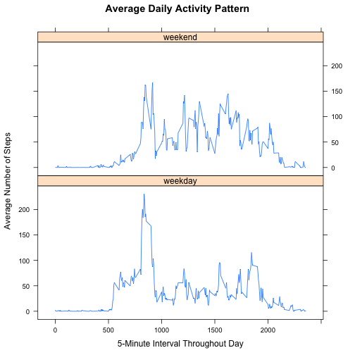

## Loading and preprocessing the data
First, install necessary packages. Knitr to create this html output file, dplyr for data manipulation, and lattice for the final panel plot.


```r
library(knitr)
library(dplyr)
library(lattice)
```
Then, load activity data set from working directory and assign column classes.


```r
activity<-read.csv("activity.csv", colClasses=c("numeric", "Date", "numeric"))
```

## What is mean total number of steps taken per day?

To answer this question, first group data by date so that a sum can be calculated.


```r
dailysteps<-group_by(activity, date)
```

Then, use the total steps for each date to create a histogram. First converting the summarize output to a numeric vector.


```r
total_dailysteps<-summarize(dailysteps, sum(steps))
num_total<-unlist(total_dailysteps[,2])
hist(num_total, main = "Histogram of Daily Step Totals",
     xlab ="Daily Step Totals")
```

 

Finally, calculate the mean and median. Based on the histogram, these should be between 10,000 and 15,000 steps since this is the bin with the greatest frequency (over 25 of the 61 days).


```r
mean(num_total, na.rm=TRUE)
```

```
## [1] 10766.19
```

```r
median(num_total, na.rm=TRUE)
```

```
## [1] 10765
```

## What is the average daily activity pattern?

First, group the data by intervals. Then find the average for each interval and graph it.


```r
intervalsteps<-group_by(activity, interval)
avg_intervalsteps<-summarize(intervalsteps, mean(steps, na.rm=TRUE))
interval<-unlist(avg_intervalsteps[,1])
num_avg<-unlist(avg_intervalsteps[,2])
plot(interval, num_avg, type="l", 
     main = "Average Daily Activity Pattern", 
     sub = "From Oct 1, 2012 to Nov 30, 2012", 
     xlab = "5-Minute Interval Throughout Day", 
     ylab="Average Number of Steps")
```

 

Lastly, identify the interval with the maximum average. Based on the plot, this should be around interval 800.


```r
filter(avg_intervalsteps, avg_intervalsteps[,2]==max(avg_intervalsteps[,2]))
```

```
## Source: local data frame [1 x 2]
## 
##   interval mean(steps, na.rm = TRUE)
## 1      835                  206.1698
```

##Imputing missing values

First, determine the number of missing cases.

```r
sum(!complete.cases(activity))
```

```
## [1] 2304
```

Then, replace missing values with the average for that interval. Use the imputed values to create a new data set to replace the existing data set.


```r
impute<-mutate(intervalsteps, interval.avg = mean(steps, na.rm=TRUE))
step.na <- is.na(impute$steps)
impute$steps[step.na] <- impute$interval.avg[step.na]
activity<-select(impute, steps, date, interval)
```

Finally, group the new data set by date and create another histogram of daily step totals.


```r
dailysteps<-group_by(activity, date)
total_dailysteps<-summarise(dailysteps, sum(steps))
num_total<-unlist(total_dailysteps[,2])
hist(num_total, main = "Histogram of Daily Step Total 
     with NA step values imputed from interval averages",
     xlab ="Daily Step Totals")
```

 

Since the missing values were replaced with interval averages, many more days now have totals around the average. The frequency count for the interval containing the mean and median has increased to over 35. 

Checking the mean and median values of the imputed data set show they they are identical after imputing.


```r
mean(num_total, na.rm=TRUE)
```

```
## [1] 10766.19
```

```r
median(num_total, na.rm=TRUE)
```

```
## [1] 10766.19
```

## Are there differences in activity patterns between weekdays and weekends?

First, convert dates to days of the week and use this to create a new column ("sort") for assigning each as weekday or weekend. Then, assign as a factor.


```r
activity$sort<-ifelse(!weekdays(as.Date(activity$date)) %in% 
                              c("Saturday", "Sunday"),"weekday","weekend")
activity$sort<-as.factor(activity$sort)
```

Now group the data by weekday or weekend, and by time interval. Find the average for each interval for weekdays and weekends. Finally, create a panel plot to compare activity patterns between weekdays and weekends.


```r
groupedsteps<-group_by(activity, sort, interval)
totalgroupedsteps<-summarise(groupedsteps, mean(steps))
sort<-unlist(totalgroupedsteps[,1])
interval<-unlist(totalgroupedsteps$interval)
avg_steps<-unlist((totalgroupedsteps$mean))
intervaldf<-data.frame(sort, interval, avg_steps)
xyplot(avg_steps ~ interval | sort, 
       intervaldf, layout = c(1, 2), type = "b", pch = "", 
       xlab ="5-Minute Interval Throughout Day", 
       ylab ="Average Number of Steps", 
       main = "Average Daily Activity Pattern")
```

 
